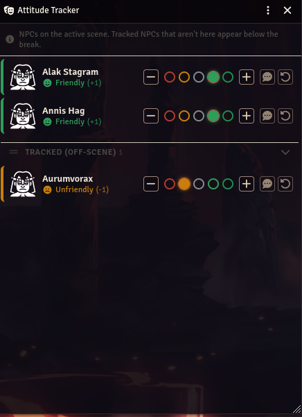
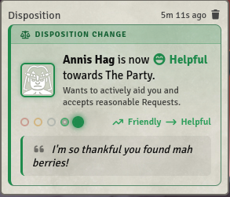

# Indifference — PF2e Disposition Tracker

A lightweight Foundry VTT v14 (hopefully) module for the Pathfinder Second Edition system plugin, that tracks
each NPC's attitude toward the party on the PF2e ladder, from a single GM dashboard — and posts
clean, official disposition-change cards to chat if a GM would like to reveal that to players.

<p align="center">
  
  
</p>

It uses teh following Pathfinder official rules regarding dispositions: 

| Value | Attitude    | Meaning |
| ----: | ----------- | ------- |
|    −2 | Hostile     | Actively seeks to harm you and won't accept Requests |
|    −1 | Unfriendly  | Dislikes and distrusts you, and won't accept Requests |
|     0 | Indifferent | Doesn't care about you one way or the other |
|    +1 | Friendly    | Likes you; likely to agree to simple, safe Requests |
|    +2 | Helpful     | Wants to actively aid you and accepts reasonable Requests |

> Most NPCs start Indifferent (0). A *Make an Impression* success bumps one step up,
> a critical success two; failures hold or drop. This tool just records where each NPC sits.

## Usage

- A masks button appears in the Token scene controls (GM only) — click it (I hope you can see it lol) to open the dashboard.
- The dashboard lists every NPC token on the **active scene**, plus any NPC you've already
  given an attitude. For each row:
  - **+ / −** step the attitude one stage (clamped to −2…+2).
  - The **colored pips** jump straight to a specific attitude.
  - The **↺** button clears the value (back to untracked).
  - **Click** a portrait to open the NPC sheet; **drag** it onto the scene to place a token.
  - Rows are ordered most-positive first; off-scene tracked NPCs sit below a collapsible break.

Changes save instantly to the actor and sync to other connected GMs. They ideally should persist between times you drop actors onto the scene. 

I tried to add a reason for attitude changes, so a GM can send them to chat. You should see a little chat button. 

It opens a dialog where you pick the attitude (defaults to current) and write a reason. **Announce**
posts to chat for everyone; **Save quietly** just records it in the NPC's timeline — players see
nothing. Nothing is ever posted by quick +/− steps or pip clicks.

By default announcements are low-meta reaction blurbs — **"Abstalar liked that!"** /
**"Abstalar didn't like that!"** ("loved"/"hated" for two-step jumps) — so players feel the shift
without seeing the ladder. If you prefer the full detailed card below, switch the
*Chat announcement style* world setting back to detailed cards.

```
┌─────────────────────────────────────┐
│  ⚖  DISPOSITION CHANGE               │
├─────────────────────────────────────┤
│  🗿 Annis Hag                        │
│  😐 Indifferent (0) → 🙂 Friendly (+1)│
│  ❝ The party cleared his name. ❞     │
└─────────────────────────────────────┘
```

If you don't change the value (just annotate the current standing), the card reads **Disposition
Note** and shows the single attitude instead of a transition.

## Timelines

Click an NPC's (or faction's) **name** in the tracker to expand its timeline: every change with a
date/time, the old → new faces, the GM's reason, and an eye-slash on anything that was never
announced to players. Quick steps are logged too, so the backlog of "what shifted while I was
improvising" is always there.

## Factions

Create factions with the flag button in the tracker toolbar — pick a name, a color, and an icon
(editable later via the pencil button on the faction's row). Factions track the party's
**reputation** on the PF2e scale, **−50 (Hunted) … +50 (Revered)**, defaulting to 0 (Ignored):

| Reputation | Tier |
| ---------: | ---- |
| 30 to 50 | Revered |
| 15 to 29 | Admired |
| 5 to 14 | Liked |
| −4 to 4 | Ignored |
| −5 to −14 | Disliked |
| −15 to −29 | Hated |
| −30 to −50 | Hunted |

Faction rows work like NPC rows — timeline, say-why dialog (with a tier legend), chat
announcements — with ± steppers and a direct number input. Expanding an NPC shows the factions it's
**assigned to** (read-only chips) and an **Edit** button that opens a checkbox picker to change them —
membership never changes from a stray click. Use the toolbar dropdown to filter NPCs to one faction's
members, or the view menu to see only NPCs / only factions.

Timeline entries (NPC or faction) can be deleted: hover one and click the ×.

## Other entry points

- **NPC sheets** get pills at the bottom-left: the NPC's attitude ("Friendly") plus one pill per
  aligned faction ("Hellknights · Liked"). Click any pill to view/update right from the sheet (GM only).
- The **token HUD** shows a single attitude face; click it to unfold the +/−/say-why controls.
- The **thumbtack** button in the tracker toolbar drops an "open the tracker" macro onto your hotbar
  (also `indifference.addHotbarButton()`).
- Using [Window Controls Next](https://foundryvtt.com/packages/window-controls-next)? The tracker
  registers itself, so its window can be pinned and minimized to the taskbar.

## Data model

Attitude is stored as flags on the base Actor:

```js
actor.getFlag("indifference", "attitude"); // -2..+2, or undefined if untracked
actor.getFlag("indifference", "log");      // [{t, from, to, reason, announced}], newest last (capped at 100)
actor.getFlag("indifference", "factions"); // ids of factions this NPC is aligned to
```

Factions live in the world setting `indifference.factions` as
`{id: {id, name, color, icon, reputation, log}}` — they're plain categorizations with 0–∞ members,
no actor documents involved. Reputation is clamped to −50…+50.

It is always stored on the canonical directory actor (`token.baseActor`), regardless of
whether a token is linked or unlinked. My goal is to make it persistent regardless of how you're adding stuff to the scene. 

## Scripting API

Exposed at both `game.modules.get("indifference").api` and `globalThis.indifference`:

```js
indifference.get(actor);          // -> current value (0 if unset)
indifference.set(actor, 2);       // -> set to Helpful (logged; pass {reason, announced} to annotate)
indifference.step(actor, -1);     // -> drop one stage (logged)
indifference.clear(actor);        // -> remove all module flags (attitude + timeline)
indifference.history(actor);      // -> [{t, from, to, reason, announced}]
indifference.info(1);             // -> { value, key, label, icon, color }
indifference.isTracked(actor);    // -> boolean
indifference.open();              // -> open the dashboard
indifference.addHotbarButton();   // -> macro on your hotbar that opens the dashboard
indifference.ATTITUDES;           // -> the full ladder

indifference.factions.all();              // -> [{id, name, color, icon, reputation, log}]
indifference.factions.create("Hellknights", { color: "#aa0000", icon: "fa-shield-halved" });
indifference.factions.update(id, { name, color, icon });
indifference.factions.set(id, -15, { reason: "We burned the chapterhouse." });
indifference.factions.assign(actor, [id1, id2]); // replace an NPC's alignments
indifference.factions.of(actor);          // -> faction ids the NPC is aligned to
indifference.factions.members(id);        // -> member actors
indifference.factions.delete(id);
indifference.repInfo(-20);                // -> { min, max, key, label, icon, color } (Hated)
indifference.deleteLogEntry("npc", actorId, 0); // drop a timeline entry by chronological index
```

A hook fires on every change so other modules/macros can react:

```js
Hooks.on("indifference.attitudeChanged", (actor, newValue, oldValue) => { /* ... */ });
```
